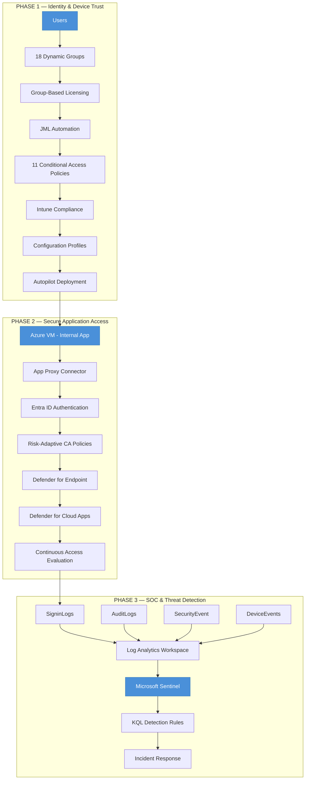
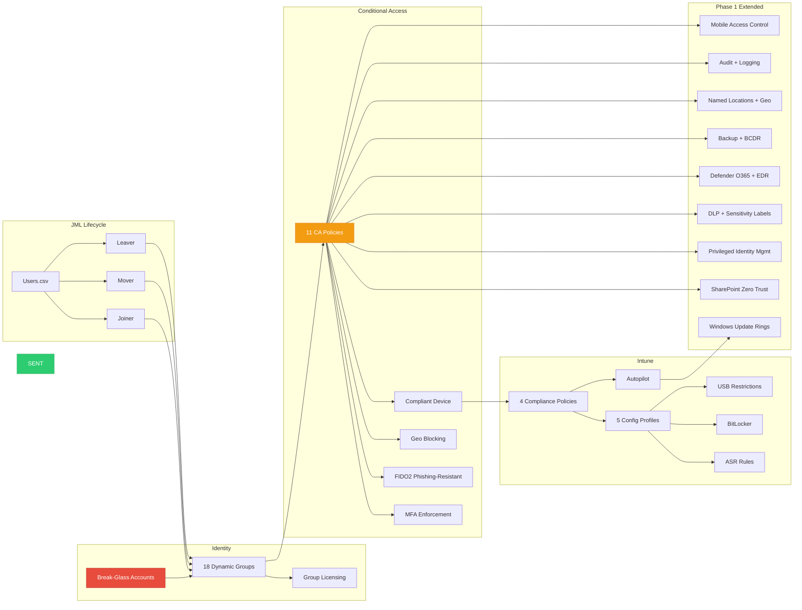
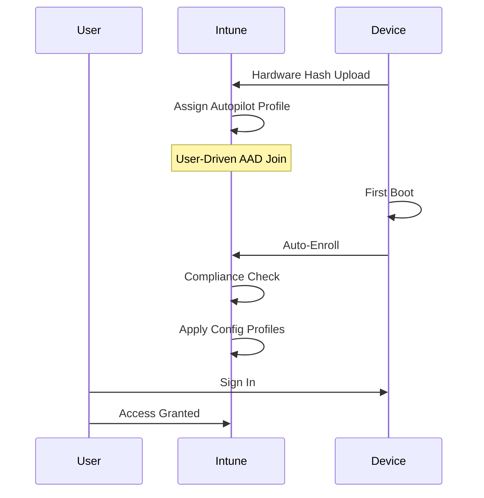
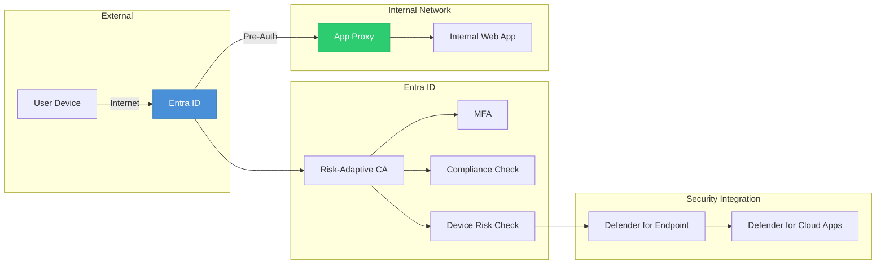
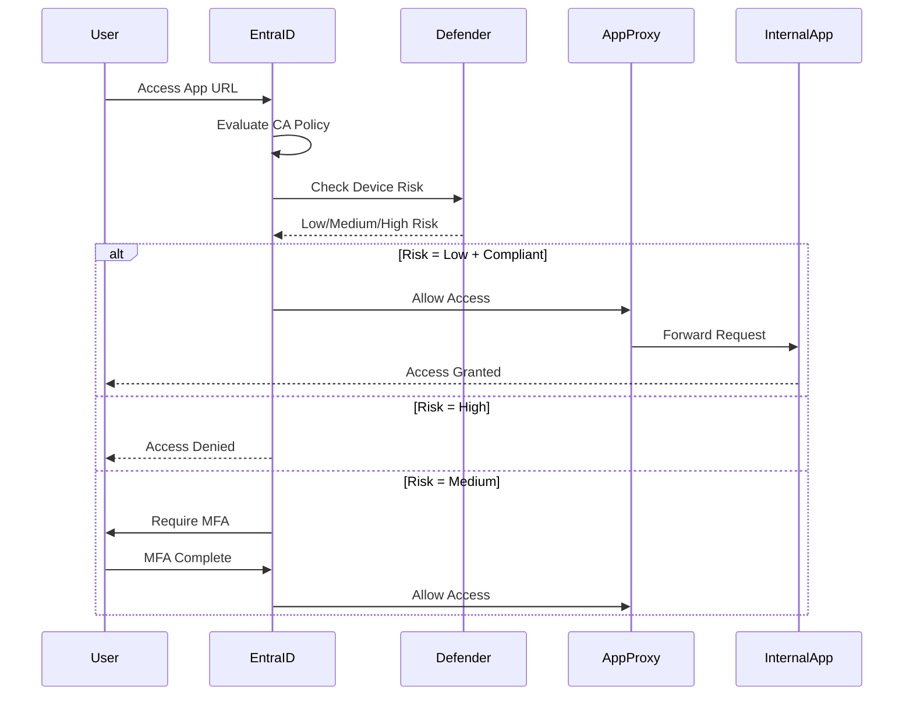
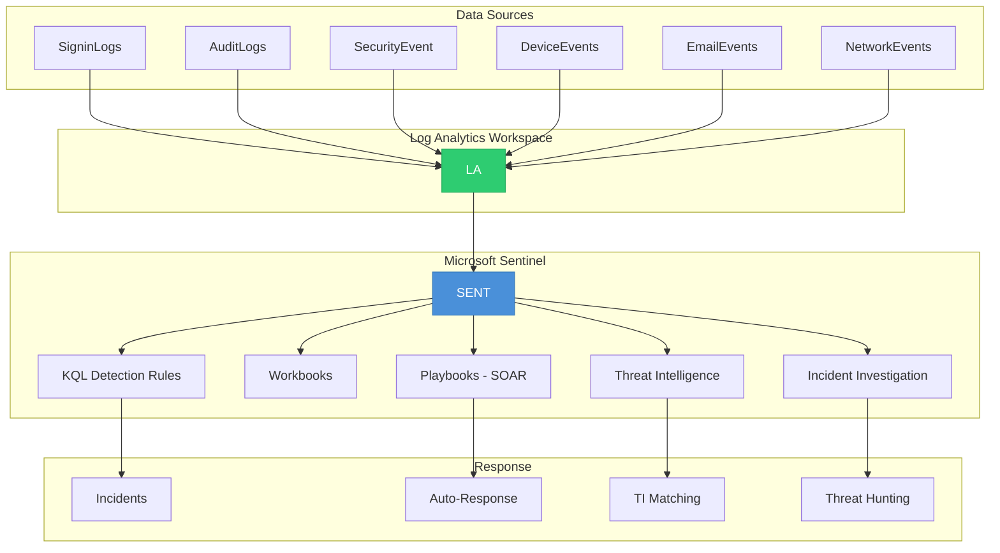
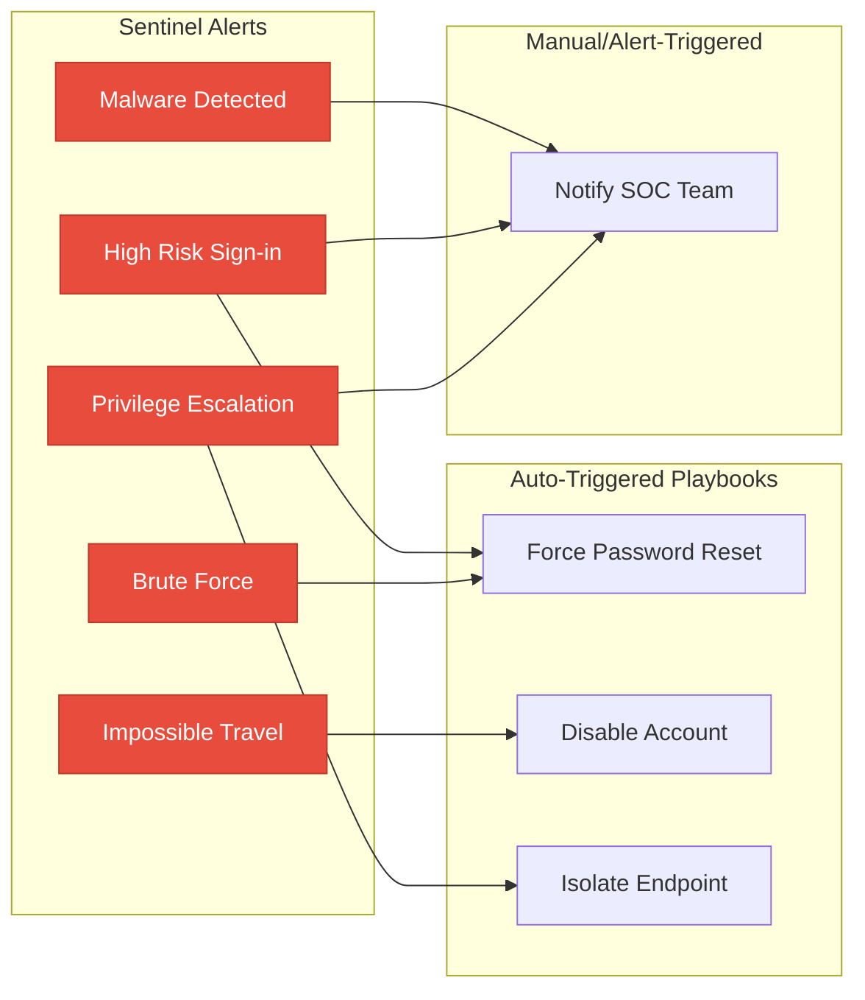
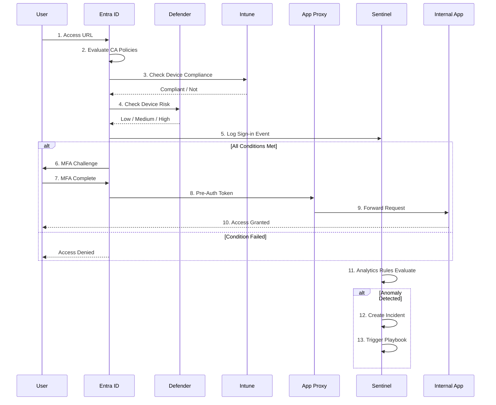
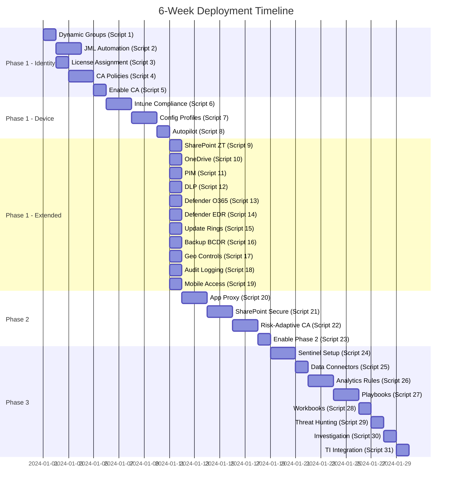

# Architecture Diagrams

> Visual reference for the 3-phase Zero Trust architecture. See [Enterprise Zero Trust Architecture 3 Phase Project.md](Enterprise%20Zero%20Trust%20Architecture%203%20Phase%20Project.md) for narrative details, security controls, and deployment timeline.

---

## End-to-End Architecture

---

## Phase 1 — Identity & Device Trust

### Component Flow

### Conditional Access Policy Matrix

| # | Policy | Action | Scope |
|---|--------|--------|-------|
| 1 | Require MFA | Block if no MFA | All users |
| 2 | Block Legacy Auth | Block | All users |
| 3 | Require Compliant Device | MFA + Compliant | All users |
| 4 | Sign-in Risk (Medium/High) | MFA | All users |
| 5 | User Risk (High) | Password Change | All users |
| 6 | Admin Protection | MFA + Compliant + FIDO2 | 6 admin roles |
| 7 | Block Untrusted Locations | Block | All users |
| 8 | SharePoint Zero Trust Access | Compliant + Joined | All users |
| 9 | Admin FIDO2 Protection | FIDO2 Only | 6 admin roles |
| 10 | Country Restriction | Block untrusted | All users |
| 11 | Session Control | 1-hour re-auth | All users |

### Intune Compliance Policies

| Policy | Platform | Key Settings |
|--------|----------|-------------|
| COMP-WIN-01 | Windows 10/11 | BitLocker, Secure Boot, Defender, Min OS 19041 |
| COMP-WIN-02 | Windows 10/11 | 12-char password, 90-day expiry, 5 history |
| COMP-MOB-01 | Android | Encryption, Jailbreak detect, Min OS 10 |
| COMP-MOB-02 | iOS | Passcode, Jailbreak detect, Min OS 16 |

### Intune Configuration Profiles

| Profile | Setting Area | Key Controls |
|---------|-------------|-------------|
| CFG-WIN-01 | Defender + Firewall | Real-time protection, ASR rules, IPSec |
| CFG-WIN-02 | USB + Bluetooth | Block storage, clipboard control |
| CFG-WIN-03 | Lock Screen + Password | 12-char, biometric, lockout |
| CFG-WIN-04 | Device Restrictions | Block Control Panel, power options |
| CFG-WIN-05 | BitLocker Encryption | AES-256, TPM, recovery key |

### Autopilot Deployment Flow

---

## Phase 2 — Secure Application Access

### Application Proxy Architecture

### Risk-Adaptive Access Flow

---

## Phase 3 — SOC & Threat Detection

### Sentinel Architecture

### Data Connector Coverage

| Connector | Log Types | Purpose |
|-----------|-----------|---------|
| Entra ID | SigninLogs, AuditLogs | Authentication & admin activity |
| M365 | Exchange, SharePoint, Teams | Email & collaboration data |
| Defender for Endpoint | DeviceEvents, DeviceLogonEvents | Endpoint detection |
| Intune | DeviceCompliance, DeviceConfig | Device management |
| Defender for Cloud Apps | CloudAppEvents | Shadow IT & SaaS |

### SOAR Playbook Triggers

---

## End-to-End Access Flow

---

## Deployment Sequence

