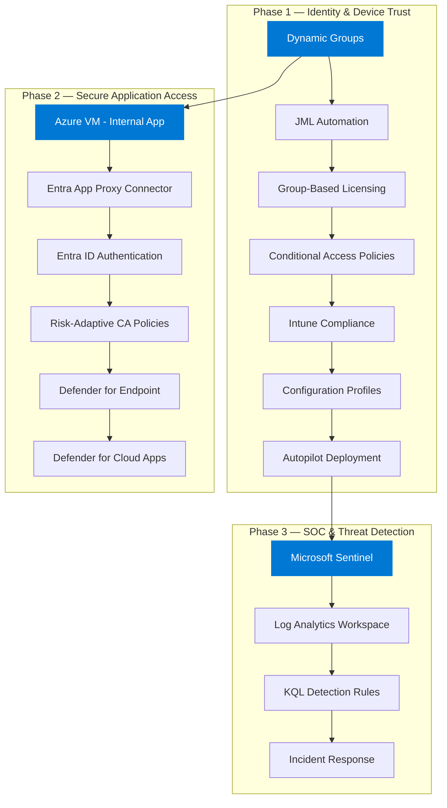

# Zero Trust Azure Security Architecture — 3 Phase Enterprise Deployment

[](https://opensource.org/licenses/MIT)
[](https://azure.microsoft.com)
[](https://docs.microsoft.com/powershell/)
[](https://entra.microsoft.com)
[](https://intune.microsoft.com)
[](https://azure.microsoft.com/products/sentinel)

> **Enterprise-grade Zero Trust security implementation** spanning identity, device, network, application, and SOC layers across 3 deployment phases — fully automated with PowerShell + Microsoft Graph API.

---

## Architecture Overview



---

## Repository Structure

```
├── 01-Architecture-Overview/
│   ├── Enterprise Zero Trust Architecture 3 Phase Project.md
│   └── Architecture Diagram.md
├── 02-Phase-Implementation/
│   ├── Phase 1 SharePoint Secure File Access Solution Zero Touch & zero trust.docx
│   ├── Phase 2 Internal Apps Without VPN.docx
│   └── Phase 3 Security Monitoring, Threat Detection & Incident Response (SOC, SIEM).docx
├── 03-Scripts/
│   ├── Phase 1 Scripts/
│   │   ├── 1. Create Dynamic Groups with department rule.ps1
│   │   ├── 2. PS Master JML Script working with User csv & group base license assignment.ps1
│   │   ├── 3. License assignment.ps1
│   │   ├── 4. Powershell commands for CA creation.ps1
│   │   ├── 5. Enable-AllCAPolicies.ps1
│   │   ├── 6. Intune Compliance Policy.ps1
│   │   ├── 7. Intune Configuration Profiles.ps1
│   │   ├── 8. Autopilot Profile Assignment.ps1
│   │   ├── 9. SharePoint Zero Trust Configuration.ps1
│   │   ├── 10. OneDrive Auto-Mapping.ps1
│   │   ├── 11. Configure PIM.ps1
│   │   ├── 12. DLP and Information Protection.ps1
│   │   ├── 13. Defender for Office 365.ps1
│   │   ├── 14. Defender for Endpoint EDR.ps1
│   │   ├── 15. Windows Update Rings.ps1
│   │   ├── 16. M365 Backup and BCDR.ps1
│   │   ├── 17. Named Locations and Geo Controls.ps1
│   │   ├── 18. Audit and Logging.ps1
│   │   └── 19. Mobile Access Control.ps1
│   ├── Phase 2 Scripts/
│   │   ├── 20. Setup Entra Application Proxy.ps1
│   │   ├── 21. Configure SharePoint Secure Access.ps1
│   │   ├── 22. Phase 2 Conditional Access Policies.ps1
│   │   └── 23. Enable Phase 2 CA Policies.ps1
│   ├── Phase 3 Scripts/
│   │   ├── 24. Deploy Sentinel Workspace.ps1
│   │   ├── 25. Configure Data Connectors.ps1
│   │   ├── 26. Create Analytics Rules.ps1
│   │   ├── 27. Deploy Playbooks.ps1
│   │   ├── 28. Create Workbooks.ps1
│   │   ├── 29. Threat Hunting Queries.ps1
│   │   ├── 30. Incident Investigation Workflow.ps1
│   │   └── 31. Threat Intelligence Integration.ps1
│   └── Users.csv
├── 04-Dynamic-Group-Design-Logic/
│   └── Group Creation Logic.xlsx
├── 05-Technology Implementation Phase WIse & BOM/
│   └── Technology Implementation Phase WIse, BOM.xlsx
├── 06-References/
│   ├── Intune-Compliance-Checklist.md
│   └── KQL_Master_Reference.md
├── 07-Screenshots/
├── 08- Deliverable CheckList/
│   └── Check Lists.xlsx
├── LICENSE
└── README.md
```

---

## How to Run

### Prerequisites

```powershell
# Install required modules
Install-Module Microsoft.Graph.Authentication -Scope CurrentUser
Install-Module Microsoft.Graph.Users -Scope CurrentUser
Install-Module Microsoft.Graph.Groups -Scope CurrentUser
Install-Module Microsoft.Graph.Identity.SignIns -Scope CurrentUser
Install-Module Microsoft.Graph.Identity.DirectoryManagement -Scope CurrentUser
Install-Module Microsoft.Graph.Users.Actions -Scope CurrentUser
Install-Module Microsoft.Graph.DeviceManagement -Scope CurrentUser
Install-Module Microsoft.Graph.Sites -Scope CurrentUser
Install-Module Microsoft.Graph.Identity.Governance -Scope CurrentUser
Install-Module Microsoft.Graph.Security -Scope CurrentUser
Install-Module Microsoft.Graph.Applications -Scope CurrentUser
Install-Module Az.Accounts -Scope CurrentUser
Install-Module Az.OperationalInsights -Scope CurrentUser
Install-Module Az.SecurityInsights -Scope CurrentUser
Install-Module Az.LogicApp -Scope CurrentUser
Install-Module ExchangeOnlineManagement -Scope CurrentUser
```

### Required Azure AD Roles

| Role | Required For |
|------|-------------|
| Global Administrator | Initial setup, CA policy creation |
| User Administrator | JML user creation/deletion |
| Intune Administrator | Compliance policies, config profiles, Autopilot |
| Security Administrator | Conditional Access, Sentinel |
| Groups Administrator | Dynamic group creation |
| Application Administrator | App Proxy setup, SharePoint access |

### Execution Order

#### Phase 1 — Identity & Device Trust

| Step | Script | What It Does |
|------|--------|--------------|
| 1 | `1. Create Dynamic Groups` | Creates 18 dynamic security groups + break-glass accounts |
| 2 | `2. PS Master JML Script` | Joiner/Mover/Leaver automation |
| 3 | `3. License assignment` | Group-based license mapping |
| 4 | `4. Powershell commands for CA creation` | 11 Conditional Access policies (MFA, SharePoint, FIDO2, geo) |
| 5 | `5. Enable-AllCAPolicies` | Enable all CA policies |
| 6 | `6. Intune Compliance Policy` | 4 compliance policies (Windows, Android, iOS) |
| 7 | `7. Intune Configuration Profiles` | 5 config profiles (Defender, USB, Lock, BitLocker, ASR rules) |
| 8 | `8. Autopilot Profile Assignment` | Autopilot setup + device group |
| 9 | `9. SharePoint Zero Trust Configuration` | SharePoint site, sharing disabled, audit, version history |
| 10 | `10. OneDrive Auto-Mapping` | Silent sign-in, auto-sync, compliance-gated sync |
| 11 | `11. Configure PIM` | JIT activation, approval, MFA, audit trail |
| 12 | `12. DLP and Information Protection` | Sensitivity labels, DLP policies, PAN/Aadhaar detection |
| 13 | `13. Defender for Office 365` | Anti-phishing, Safe Links, Safe Attachments, external tagging |
| 14 | `14. Defender for Endpoint EDR` | EDR block mode, AIR, ransomware rollback |
| 15 | `15. Windows Update Rings` | Pilot/Production/Emergency update rings |
| 16 | `16. M365 Backup and BCDR` | Backup config, RPO 24h, RTO 4-8h, restore testing |
| 17 | `17. Named Locations and Geo Controls` | Trusted locations, country block, TOR block |
| 18 | `18. Audit and Logging` | Unified Audit Log, retention, admin alerts |
| 19 | `19. Mobile Access Control` | Block mobile default, MAM app protection policies |

#### Phase 2 — Secure Application Access

| Step | Script | What It Does |
|------|--------|--------------|
| 20 | `20. Setup Entra Application Proxy` | App Proxy with pre-auth, connector group |
| 21 | `21. Configure SharePoint Secure Access` | SharePoint sharing, device access, session policies |
| 22 | `22. Phase 2 Conditional Access Policies` | Risk-adaptive CA with device risk, app scoping |
| 23 | `23. Enable Phase 2 CA Policies` | Transition report-only to enforced |

#### Phase 3 — SOC & Threat Detection

| Step | Script | What It Does |
|------|--------|--------------|
| 24 | `24. Deploy Sentinel Workspace` | Log Analytics + Sentinel SIEM setup |
| 25 | `25. Configure Data Connectors` | Entra, Defender, Intune, M365, Cloud Apps connectors |
| 26 | `26. Create Analytics Rules` | 6 threat detection rules (impossible travel, malware, risk) |
| 27 | `27. Deploy Playbooks` | SOAR automation (disable account, reset password, isolate endpoint) |
| 28 | `28. Create Workbooks` | 6 security dashboards (auth, alerts, endpoints, CA, SOC, app access) |
| 29 | `29. Threat Hunting Queries` | 6 pre-built KQL hunting queries |
| 30 | `30. Incident Investigation Workflow` | 8-step investigation workbook with 21 KQL queries |
| 31 | `31. Threat Intelligence Integration` | TI blade, STIX/TAXII feeds, TI matching rules |

---

## Phase Details

### Phase 1 — Identity & Device Trust

```
Users ──▶ Dynamic Groups ──▶ Licenses ──▶ Conditional Access ──▶ Intune ──▶ Autopilot ──▶ SharePoint/OneDrive
```

- 18 dynamic groups (department, company, location) + break-glass accounts
- Automated JML lifecycle (Joiner/Mover/Leaver)
- 11 Conditional Access policies (MFA, SharePoint ZT, FIDO2, geo-blocking)
- Intune compliance + configuration profiles with granular ASR rules
- Windows Autopilot zero-touch deployment
- SharePoint Zero Trust (site, sharing disabled, audit logging)
- OneDrive silent sign-in + auto-sync
- PIM (JIT activation, approval, MFA enforcement)
- DLP + Sensitivity Labels (Public/Internal/Confidential/Highly Confidential)
- Defender for Office 365 (anti-phishing, Safe Links, Safe Attachments)
- Defender for Endpoint EDR (block mode, AIR, ransomware rollback)
- Windows Update Rings (Pilot/Production/Emergency)
- M365 Backup + BCDR (RPO 24h, RTO 4-8h)
- Named locations + geo-blocking (TOR, untrusted countries)
- Unified Audit Log + admin activity alerts
- Mobile access control (block default, MAM policies)

### Phase 2 — Secure Application Access

```
Internal App ──▶ App Proxy Connector ──▶ Entra ID ──▶ Risk-Adaptive CA ──▶ Access
```

- Azure VM hosting internal web application
- Entra Application Proxy (no VPN, no inbound ports)
- Risk-adaptive Conditional Access policies
- Defender for Endpoint device risk integration
- Defender for Cloud Apps session control
- Continuous Access Evaluation

### Phase 3 — SOC & Threat Detection

```
Data Sources ──▶ Sentinel ──▶ Analytics Rules ──▶ Incidents ──▶ SOAR Response ──▶ Investigation
```

- Microsoft Sentinel SIEM deployment
- 5 data connectors (Entra ID, M365, Defender for Endpoint, Intune, Defender for Cloud Apps)
- 6 analytics rules (impossible travel, privileged role abuse, suspicious downloads, malware outbreak, high-risk sign-in, brute force)
- 4 SOAR playbooks with auto-triggers (disable account, force password reset, isolate endpoint, notify SOC)
- 6 security dashboards (authentication, alerts, endpoints, Conditional Access, SOC overview, app access)
- 6 threat hunting queries (suspicious logins, lateral movement, data exfiltration, compromised endpoints, privilege escalation, persistence)
- 8-step incident investigation workbook with 21 KQL queries
- Threat Intelligence integration (Microsoft TI, STIX/TAXII, 5 TI matching rules)
- 30+ KQL detection rules mapped to MITRE ATT&CK

---

## Key Features

- **Zero Touch JML** — Fully automated user lifecycle
- **Dynamic Groups** — Auto-populated based on department, company, location
- **Break-Glass Accounts** — Emergency access accounts created on Day 1
- **Conditional Access** — MFA, compliant device, risk-based, FIDO2, geo-blocking policies
- **SharePoint Zero Trust** — External sharing disabled, audit logging, version history
- **OneDrive Auto-Mapping** — Silent sign-in, compliance-gated file sync
- **Privileged Identity Management** — JIT activation, approval workflows, MFA enforcement
- **DLP & Sensitivity Labels** — PAN/Aadhaar detection, data classification
- **Defender for Office 365** — Anti-phishing, Safe Links, Safe Attachments
- **Defender EDR** — Attack Surface Reduction, automated investigation, ransomware rollback
- **Windows Update Rings** — Pilot/Production/Emergency ring strategy
- **M365 Backup** — RPO 24h, RTO 4-8h, restore testing
- **Geo Controls** — Country blocking, TOR blocking, trusted locations
- **Audit & Logging** — Unified Audit Log, admin activity alerts
- **Mobile Access Control** — Block mobile default, MAM app protection
- **App Proxy** — Internal apps published without VPN
- **Intune Compliance** — BitLocker, Secure Boot, Defender, password policies
- **Autopilot** — Zero-touch device provisioning
- **Sentinel SIEM** — Centralized security monitoring and threat detection
- **SOAR Playbooks** — Automated incident response with auto-triggers
- **Threat Hunting** — Pre-built KQL queries for proactive investigation
- **Incident Investigation** — 8-step workbook with 21 KQL queries
- **Threat Intelligence** — Microsoft TI, STIX/TAXII feeds, TI matching rules
- **KQL Reference** — 30+ detection scenarios mapped to MITRE ATT&CK

---

## Security Controls Matrix

| Layer | Control | Tool | Automation |
|-------|---------|------|------------|
| Identity | MFA | Entra ID + CA | Script 4 |
| Identity | Risk-based access | Entra ID Protection | Script 4, 22 |
| Identity | Break glass accounts | Entra ID Groups | Script 1 |
| Identity | FIDO2 phishing-resistant | Entra ID CA | Script 4 |
| Identity | Privileged access | PIM | Script 11 |
| Device | Compliance check | Intune | Script 6 |
| Device | Configuration | Intune Profiles | Script 7 |
| Device | Zero-touch deploy | Autopilot | Script 8 |
| Device | Remote wipe | Intune | Script 2 |
| Device | ASR rules | Intune Profiles | Script 7 |
| Device | EDR + ransomware rollback | Defender for Endpoint | Script 14 |
| Device | Update rings | Windows Update | Script 15 |
| Application | App Proxy | Entra App Proxy | Script 20 |
| Application | SharePoint secure | Entra ID | Script 21, 9 |
| Application | Risk-adaptive CA | Entra ID + Defender | Script 22 |
| Application | OneDrive auto-sync | Intune + Entra | Script 10 |
| Application | Mobile app protection | Intune MAM | Script 19 |
| Data | BitLocker encryption | Intune | Script 7 |
| Data | USB restrictions | Intune | Script 7 |
| Data | DLP + sensitivity labels | Purview | Script 12 |
| Data | Backup + BCDR | M365 Backup | Script 16 |
| Network | Location-based | CA Policy | Script 4, 22, 17 |
| Network | Country + TOR blocking | CA Policy | Script 17 |
| Email | Anti-phishing | Defender for Office 365 | Script 13 |
| Email | Safe Links + Attachments | Defender for Office 365 | Script 13 |
| Patch | Update governance | Windows Update Rings | Script 15 |
| Audit | Unified Audit Log | M365 | Script 18 |
| SOC | SIEM monitoring | Sentinel | Script 24 |
| SOC | Data connectors | Sentinel | Script 25 |
| SOC | Threat detection | Analytics Rules | Script 26 |
| SOC | Incident response | SOAR Playbooks | Script 27 |
| SOC | Security dashboards | Workbooks | Script 28 |
| SOC | Threat hunting | KQL Queries | Script 29 |
| SOC | Incident investigation | Investigation Workbook | Script 30 |
| SOC | Threat intelligence | TI Integration | Script 31 |
| SOC | Detection rules | KQL Reference | 30+ Scenarios |

---

## Author

**Sagar Deshpande** — Cloud & Security Engineer
- LinkedIn: [sagardeshpandeaws](https://www.linkedin.com/in/sagar-deshpande-8793357387dsp/)
- GitHub: [sagardeshpandeaws](https://github.com/sagardeshpandeaws)

## License

MIT
